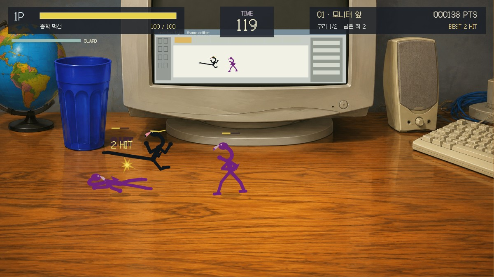
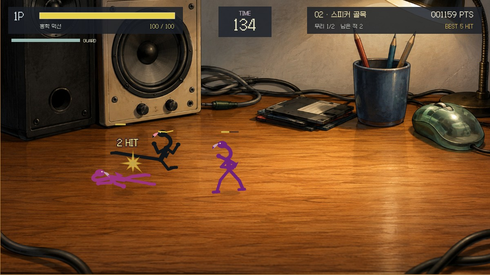
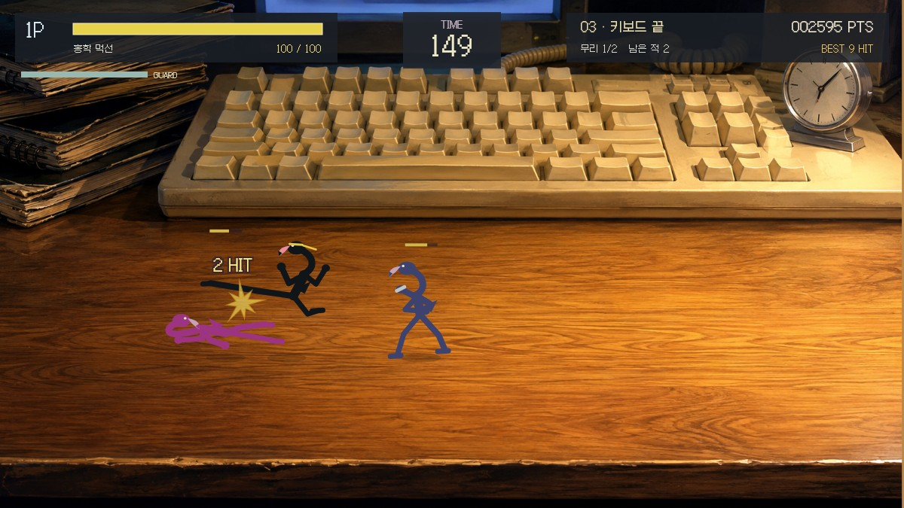
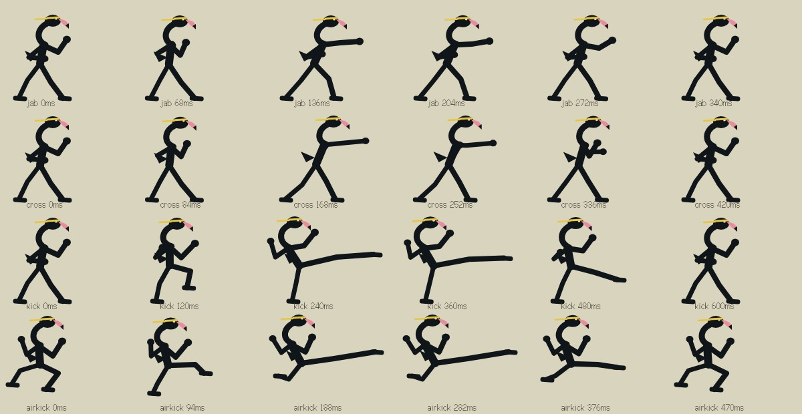

# 플라밍고 샤오 — 책상 위의 결투

**모니터 앞에서 시작해, 키보드 끝까지. 작은 먹선 홍학의 한 발, 한 주먹.**

Xiao Xiao 9의 책상 위 격투 구도를 참고한 독립 패러디 게임입니다. 검은 먹선 홍학이 거대한 컴퓨터 소품 사이에서 싸웁니다. 몸은 그림 한 장을 움직이는 방식이 아니라, **11개 관절과 S자 목·부리를 직접 그린 연속 자세**로 구성됩니다.

[](docs/browser-qa.md)

> 맨 위는 실제 브라우저 플레이 캡처입니다. 아래 세 구역 카드와 관절 트랙은 같은 게임 렌더러로 만든 **오프라인 CPU 캡처**이며, [실제 입력 검수](docs/browser-qa.md)와 구분합니다.

<table>
<tr>
<td width="33%"><a href="docs/cpu-previews/area-1.jpg"></a><br><b>01 / 모니터 앞</b><br>CRT 속 프레임 에디터도 같은 전투를 그립니다.</td>
<td width="33%"><a href="docs/cpu-previews/area-2.jpg"></a><br><b>02 / 스피커 골목</b><br>거대한 우퍼, 연필 컵, 플로피 디스크 사이.</td>
<td width="33%"><a href="docs/cpu-previews/area-3.jpg"></a><br><b>03 / 키보드 끝</b><br>마지막 무리와 수문장 보스.</td>
</tr>
</table>

## 바로 실행

Node.js 22.12 이상:

```sh
npm ci
npm run dev
```

[로컬 결투장 열기 · 127.0.0.1:4207](http://127.0.0.1:4207/) — 개발 서버가 실행 중인 같은 컴퓨터에서 사용합니다. 배포 주소가 아닙니다. 포트 충돌 시 임의의 다른 포트로 옮기지 않습니다.

```sh
npm test
npm run build
npm run capture
```

Sites나 공유 게임 엔진은 사용하지 않습니다. 코드·그림·폰트가 독립 빌드 안에 들어갑니다. 계정, 광고, 분석 수집, CDN 런타임, 외부 API, 게임 원본 SWF가 필요하지 않습니다. 서버 배포 설정도 포함하지 않았습니다.

## 조작

| 키 | 행동 |
|---|---|
| ← / → | 좌우 이동·방향 전환 |
| ↑ / ↓ | 책상 안쪽·바깥쪽으로 이동 |
| Z 연속 입력 | 잽 → 반대손 → 돌려차기 |
| X | 점프 |
| 공중에서 Z | 날아차기 |
| C 유지 | 앞쪽 공격 방어. 방어 게이지를 소비 |
| 맞기 직전 C → Z | 받아치기 → 강한 반격 |
| P / Esc | 일시정지·재개 |

하단 버튼으로 터치 조작도 할 수 있습니다. **Z를 누른 채 유지하는 것은 자동 연사가 아닙니다.** 회복 동작의 끝에서 다음 Z를 누르면 연속기로 연결됩니다. 상대와 깊이가 다르거나 등을 돌리면 빗나갑니다. 공격 예고가 보이면 막거나, 깊이를 바꾸거나, 뛰어넘어 보세요.

모든 적을 제압하면 다음 무리가 등장하고 체력이 12 회복됩니다. 한 구역을 끝내고 다음 구역으로 넘어가면 28 회복됩니다. 마지막 수문장을 포함해 세 구역의 적 12명을 모두 제압하면 성적표가 나옵니다. 체력 또는 시간이 다하면 실패하며 처음부터 재시작할 수 있습니다. 연습 모드는 시간 제한만 없애고 전투 규칙은 유지합니다.

소리는 기본 꺼짐입니다. 창이 포커스를 잃거나 숨겨지면 정지하며, 눌린 키·터치·예약 동작을 해제합니다. 복귀 후 직접 계속하기를 눌러야 합니다. 세로 휴대폰에도 화면을 축소해 보여 주지만 정밀 격투는 가로 화면/키보드가 편합니다.

## 동작을 새로 그렸습니다



준비 → 접촉 → 회수 자세가 각 공격의 판정 시간과 연결됩니다. 짧은 타격 정지 중 들어온 Z/X도 버퍼에 남았다가 재개 후 처리됩니다. 넘어짐, 기상, 방어, 받아치기, 공중 공격이 서로 다른 자세를 사용합니다. 상대는 전후 깊이로 정렬되며, 보스는 큰 실루엣·긴 공격 예고·공격 중 버티기·후반 공중 대응기를 가집니다.

## 문서와 링크

| 자료 | 내용 |
|---|---|
| [아트 디렉션](docs/art-direction.md) | 실제 원작 관찰 6개와 패러디의 변경 범위 |
| [자산·생성 프롬프트](docs/assets.md) | 배경 3장, 코드 캐릭터, 로컬 폰트와 라이선스 |
| [검증 범위](docs/validation.md) | 24개 검사, 정상 입력 완주, CPU와 브라우저 증거의 구분 |
| [플라밍고 독립 게임 모음](https://github.com/minwoo19930301/flamingo-arcade-2) | 다른 게임 저장소로 이동 |
| [Zhu의 Xiao Xiao 9](https://www.newgrounds.com/portal/view/65694) | 원작 저자 게시 페이지 |
| [Stickpage 원작 소개](https://www.stickpage.com/xiao9.shtml) / [원작 플레이](https://www.stickpage.com/xiao9play.shtml) | 실제 플레이 화면을 관찰한 참고작 |

원작 저자는 Zhu입니다. 원작 스프라이트·캐릭터 모델·SWF·음악·로고·게임 캡처를 배포하지 않습니다. 이 게임은 별도 창작 홍학 패러디이며 공식 후속작이나 완전 복제품을 표방하지 않습니다.
