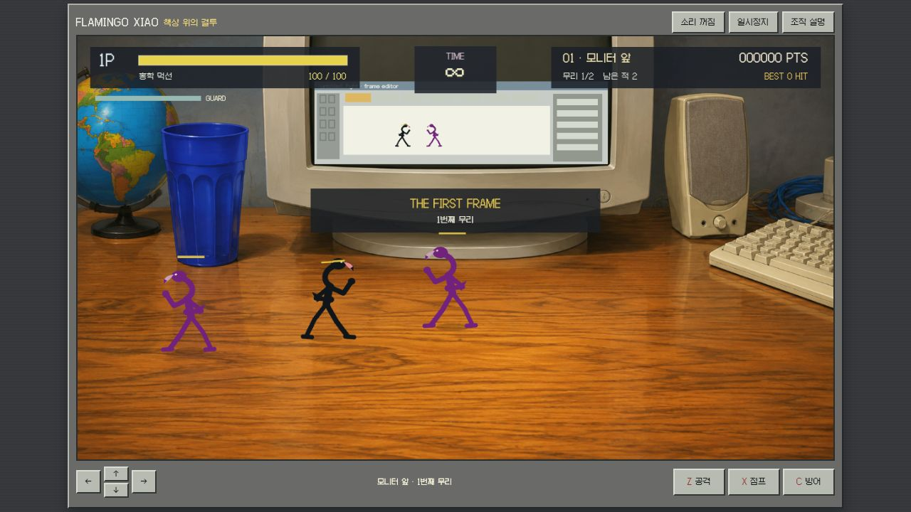

# 실제 브라우저 검수

2026-09-07 · 로컬 4207 · Chromium 기반 브라우저 1280×720. 실제 클릭·키보드 입력을 사용했으며 HP·점수·승리 상태를 주입하지 않았습니다.

- 타이틀에서 연습 모드로 진입했습니다. TIME ∞, 체력 100, 두 적, 거대한 CRT·컵·키보드와 하단 조작 버튼이 화면 안에 표시됩니다.
- 짧은 Z 연속 입력으로 잽/돌려차기 동작, **3 HIT · 274점 · 적 1명 제압**을 확인했습니다. 플레이어와 적의 체력 감소, 넘어진 자세가 실제 전투와 연결됩니다.
- X 입력으로 지면을 떠난 자세를 관찰했습니다. 공중 Z 판정과 타격 정지 중 X 보존은 추가 CPU 검사로 확인하며, 사람이 모든 공중 연속기를 성공했다는 주장은 하지 않습니다.
- P로 정지 패널이 뜨고 계속하기로 재개됩니다. 이후 실제 적 공격으로 HP 0 패배, 처음부터 다시로 HP 100·0점·첫 책상 복원까지 확인했습니다.
- 최초 패배 화면에서 `다음 책상으로`가 잘못 보였습니다. CSS가 native hidden을 덮는 문제를 수정한 뒤 다시 자연 피격으로 패배하여 **재시작만 표시되고 다음 버튼은 숨겨짐**을 실제 화면과 접근성 트리 모두에서 확인했습니다.
- `preview.jpg`는 수정 후 재시작한 실제 플레이 화면입니다. 검수 중 브라우저 경고·오류 로그는 0건이었습니다.

24개 CPU 검사와 프로덕션 빌드가 통과했습니다. 세 책상·보스 포함 12명 완주는 일반 입력 정책의 CPU 검증이며 사람이 브라우저에서 연속 완주한 기록은 아닙니다. 실제 모바일 기기·다중 터치·오디오 청취·장시간 밸런스는 미검증입니다.
